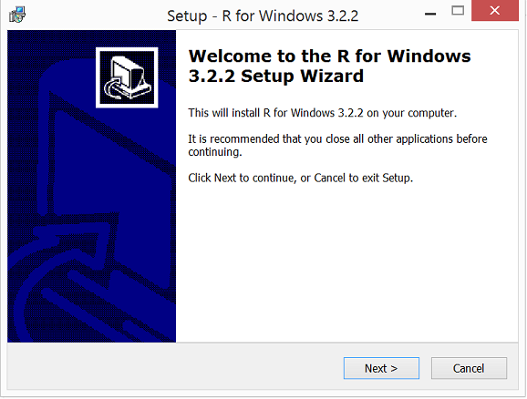
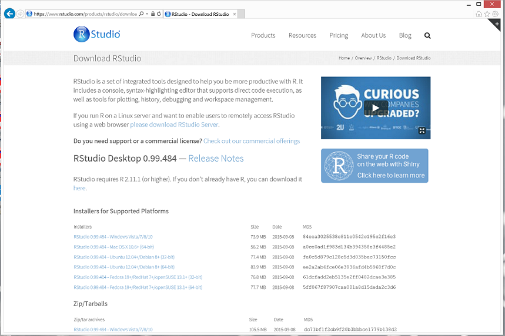

## Install Overview

Installing R is a pretty straightforward process.  I like to use RStudio for the development environment.  The installation is a two step process.

- Install R
- Install RStudio

The links for both of these packages are provided in the subsequent pages.

## Install R

R Download Link
[Official R Download Link](https://cran.r-project.org/bin/windows/base/)

## Download and Install RStudio

R Studio Download Link
[Official R Download Link](https://www.rstudio.com/products/rstudio/download/)

## Tips and Tricks

I didn't have any issues with the installation.  I just went with the default choices and it went off without a hitch.  I've got a 64 bit Windows 7 computer, I haven't tried the installation on any other OS.  

The following screen shows the RStudio development environment.

## R Studio Environment

## Practicum Presentation Download

My instructions, presentation and files are available on github.

Github link for files: <https://github.com/trineary/practicum>
