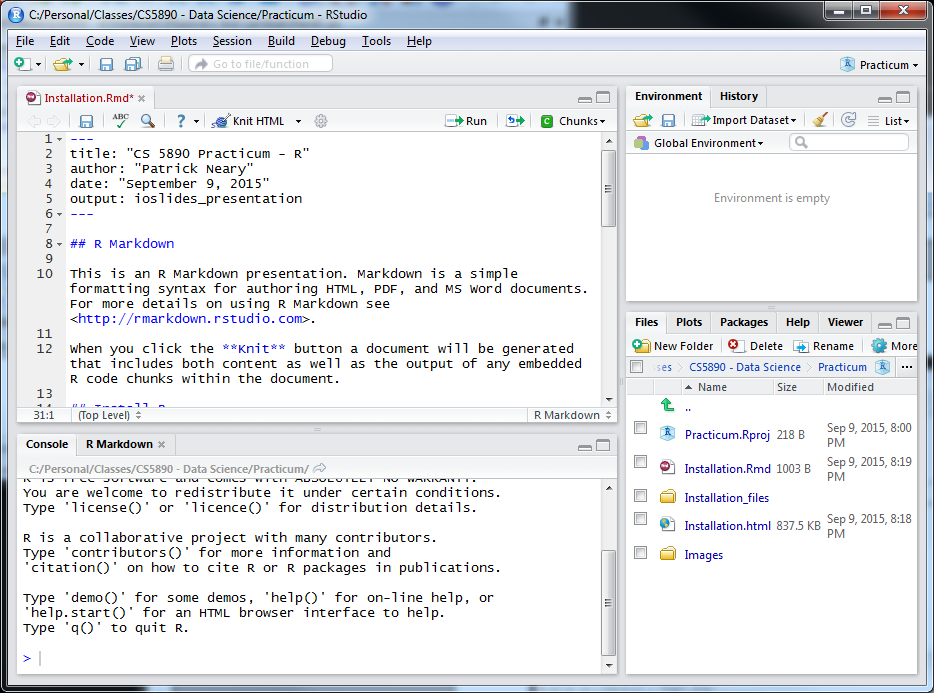
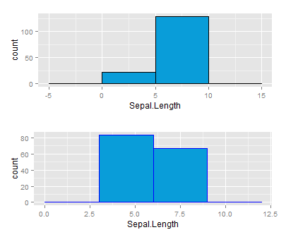

## Presentation Objectives

- Why do we care about R?
- Quick overview of the RStudio IDE
- Explanation of R Markdown and its usefulness
- Packages in R
- How to reference a Package from code
- Example of code referencing a package
- Presentation for creating packages
- Lots of links for anyone interested in further information

## Why do We care about R?

1.  Traditional languages (C, C++, Java)
2.  What does R do that traditional languages don't?
    + Originally written for statisticians
    + Used more and more by data analysts
    + Companies that use it: Google, Pfizer, Merc, Bank of America, Shell, etc.
    + Rich set of tools for working with data (data science, machine learning, etc.)
    + Rich set of tools for viewing data results
    + Vast collection of packages
    + Easy to contribute your own packages


## R Studio Environment




## R Markdown


This is an R Markdown presentation. Markdown is a simple formatting syntax for authoring HTML, PDF, and MS Word documents. For more details on using R Markdown see <http://rmarkdown.rstudio.com>.

When you click the **Knit** button a document will be generated that includes both content as well as the output of any embedded R code chunks within the document.


## Packages in R
What is a Package?

> Packages are collections of R functions, data, and compiled code in a well-defined format.

Where do packages reside?

> Packages can be stored in github or on local machines


## How to reference a package from code

Referencing a package that is on github is very simple.  The following code excerpt shows how it's done:

```
  install_github('trineary/multiplot','trineary')
  library(multiplot)
```

The first line downloads the block of code from github into a local directory.  The second line loads the Package into the current workspace so it's functions are exposed.

## Example code: referencing Package on github, including Package, and calling function in Package

Going to show an example using the 'iris' data set, ggplot, and the multiplot function residing on github.

```
  install.packages("ggplot2", repos = 'http://cran.us.r-project.org')
  install.packages("devtools", repos = 'http://cran.us.r-project.org')
  library(devtools)
  library(ggplot2)

  install_github('trineary/multiplot','trineary')
  library(multiplot)

  # Load the iris data set
  data("iris")

  # Store data into two variables
  p1 <- ggplot(aes(x=Sepal.Length), data=iris) +
   geom_histogram(binwidth = 5, color = 'black', fill = '#099DD9')

  p2 <- ggplot(aes(x=Sepal.Length), data=iris) +
   geom_histogram(binwidth = 3, color = 'blue', fill = '#099DD9')

  # Plot the data in a column using the multiplot Package we uploaded to github
  multiplot(p1, p2, cols=1)
  
```



## Presentation for creating packages

Markdown presentation (CreatingPacakages.rmd) available with practicum materials.  

7 Steps to creating a package:

1. Create a directory for the R Package
2. Add function/code
3. Add documentation
4. Process Documentation
5. Run Install command
6. Make GitHub repo
7. Download and use repo in future projects


## Other Useful References
Data Visualization

- Data Visualization cheat sheet: <https://www.rstudio.com/wp-content/uploads/2015/08/ggplot2-cheatsheet.pdf>
- Data wrangling cheat sheet: <https://www.rstudio.com/wp-content/uploads/2015/02/data-wrangling-cheatsheet.pdf>

R Markdown

- RMarkdown cheat sheet: <https://www.rstudio.com/wp-content/uploads/2015/02/rmarkdown-cheatsheet.pdf>
- R Markdown Reference guide can be found here: <https://www.rstudio.com/wp-content/uploads/2015/03/rmarkdown-reference.pdf>

Packages

- R Package cheat sheet: <https://www.rstudio.com/wp-content/uploads/2015/06/devtools-cheatsheet.pdf>
- Online book about creating R Packages: <http://r-pkgs.had.co.nz/>
- Blog on creating package to upload to github: <http://hilaryparker.com/2014/04/29/writing-an-r-package-from-scratch/>

Online classes on Data Science and R

- Coursera classes on R and data science <https://www.coursera.org/specializations/jhudatascience>

Online book

- Another online book: <http://adv-r.had.co.nz/>

Useful variety of information

- Single page, many useful links: <https://www.rstudio.com/resources/training/online-learning/#R>
- Other built in functions in R: <http://www.statmethods.net/management/functions.html>

Github

- Blog on setting up github to host package: <http://www.r-bloggers.com/creating-your-personal-portable-r-code-library-with-github/>
